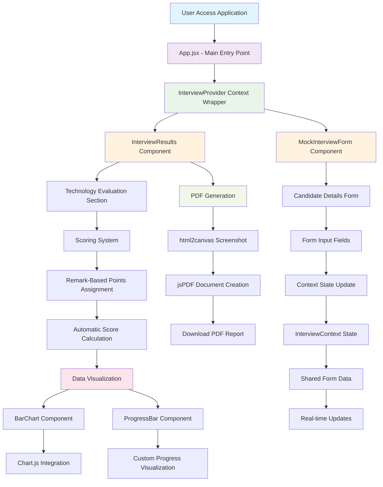
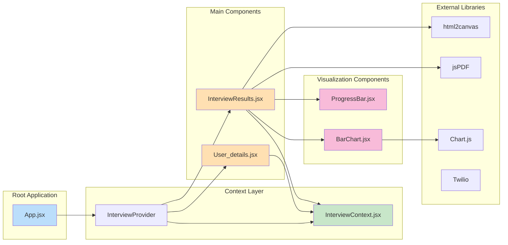
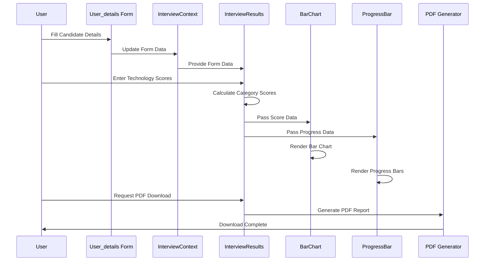
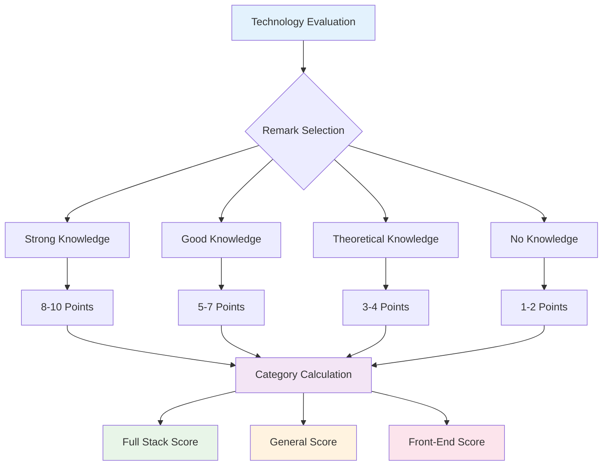
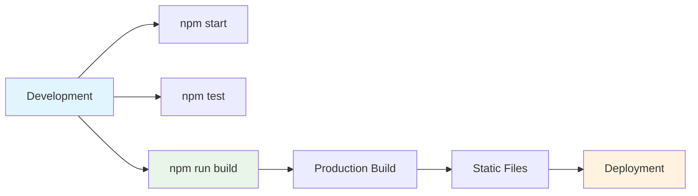

# Mock Interview Application - Project Flow & Architecture

## Project Overview

The Mock Interview Application is a React-based web application designed for interviewers to evaluate candidates across multiple technologies, calculate scores automatically, and generate comprehensive reports with visual analytics.

## Technology Stack

- **Frontend Framework**: React 18.3.1
- **State Management**: React Context API
- **Charting**: Chart.js 4.4.3 + React-ChartJS-2 5.2.0
- **PDF Generation**: jsPDF 2.5.1
- **Screenshot Capture**: html2canvas 1.4.1
- **Communication**: Twilio 5.2.0
- **Build Tool**: Create React App (react-scripts 5.0.1)
- **Styling**: CSS3

## Project Flow Diagram

## Component Architecture

## Data Flow Architecture

## Module Breakdown

### 1. Core Application Structure

| File | Purpose | Dependencies |
|------|---------|-------------|
| `App.jsx` | Main application entry point | InterviewContext |
| `index.jsx` | React DOM rendering | React, ReactDOM |
| `App.css` | Application styling | - |

### 2. State Management

| File | Purpose | Key Features |
|------|---------|-------------|
| `InterviewContext.jsx` | Global state management | Context API, Form data storage |
| `FullStackContext.jsx` | Additional context (if used) | Extended state management |

### 3. Form Components

| File | Purpose | Key Features |
|------|---------|-------------|
| `User_details.jsx` | Candidate information form | Input validation, Batch selection |

### 4. Results & Evaluation

| File | Purpose | Key Features |
|------|---------|-------------|
| `InterviewResults.jsx` | Main evaluation interface | Technology scoring, PDF generation |

### 5. Visualization Components

| File | Purpose | Libraries Used |
|------|---------|---------------|
| `BarChart.jsx` | Technology score visualization | Chart.js, react-chartjs-2 |
| `ProgressBar.jsx` | Progress indicators | Custom CSS animations |

## Scoring System

## Key Features

### 📝 **Form Management**
- Candidate detail collection
- Real-time form validation
- Batch selection dropdown
- Context-based state management

### 📊 **Scoring System**
- Technology-based evaluation (14 categories)
- Remark-driven point assignment
- Automatic category score calculation
- Real-time score updates

### 📈 **Data Visualization**
- Interactive bar charts (Chart.js)
- Custom progress indicators
- Responsive design
- Real-time data binding

### 📄 **Report Generation**
- PDF export functionality
- Screenshot integration
- Comprehensive candidate reports
- Downloadable interview summaries

### 🔧 **Technical Architecture**
- React Context API for state management
- Component-based architecture
- Modern React hooks
- Responsive CSS design

## Build & Deployment

## Dependencies Summary

### Production Dependencies
- **React Ecosystem**: react@18.3.1, react-dom@18.3.1
- **Charting**: chart.js@4.4.3, react-chartjs-2@5.2.0
- **PDF Generation**: jspdf@2.5.1, html2canvas@1.4.1
- **Communication**: twilio@5.2.0
- **Performance**: web-vitals@2.1.4

### Development Dependencies
- **Testing**: @testing-library/jest-dom, @testing-library/react, @testing-library/user-event
- **Build Tools**: react-scripts@5.0.1

This application demonstrates a well-structured React application with clear separation of concerns, effective state management, and comprehensive feature set for interview evaluation and reporting.
